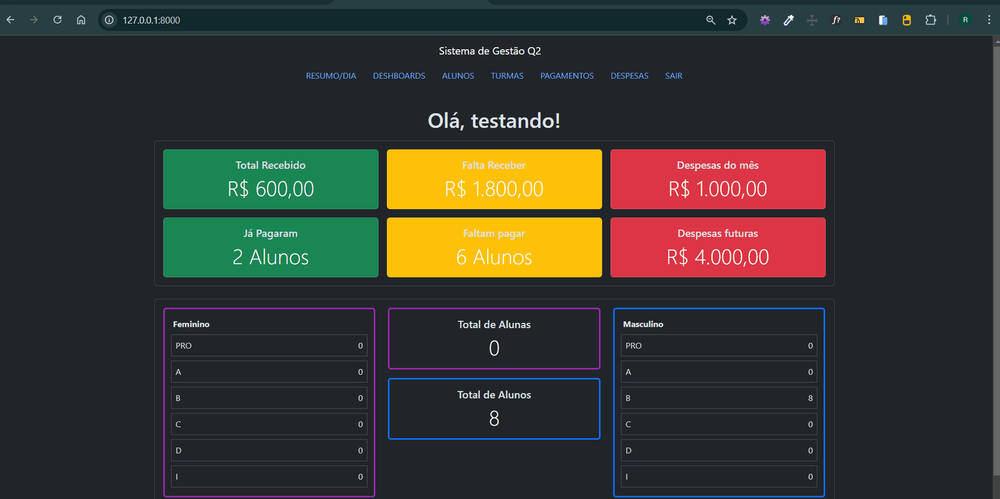

## 📌 Índice
- [Sobre o Projeto](#sobre-o-projeto)
- [Instalação Local](#instalação-local)
- [Funcionalidades](#funcionalidades)
- [Aprendizados](#aprendizados)
- [Stack utilizada](#stack-utilizada)
- [Melhorias Futuras](#melhorias-futuras)
- [Demonstração](#demonstração)


# Sistema de Gerenciamento Esportivo Q2

Projeto desenvolvido para gerenciar aulas e pagamentos de alunos de uma empresa de beach tenis, cliente espera com o sistema se livrar de planilhas excel tendo maior controle sobre seus gastos, ganhos e treinos.


## 🚀 Instalação Local  

Siga os passos abaixo para configurar o projeto em sua máquina:  

### 1️⃣ Clone este repositório  
```bash
git clone https://github.com/Ramonlleopoldo/sistema_gestao_financeira.git
```

### 2️⃣ Acesse a pasta do projeto  
```bash
cd sistema_gestao_financeira
```

### 3️⃣ Crie e ative um ambiente virtual  

- **No Windows**  
```bash
python -m venv venv
venv\Scripts\activate
```
- **No Linux/macOS**  
```bash
python -m venv venv
source venv/bin/activate
```

### 4️⃣ Instale as dependências do projeto  
```bash
pip install -r requirements.txt
```

### 5️⃣ Configure o banco de dados  
```bash
python manage.py migrate
```

### 6️⃣ Crie um superusuário (Você precisará definir um nome de usuário, e-mail e senha)  
```bash
python manage.py createsuperuser
```

### 7️⃣ Execute o servidor  
```bash
python manage.py runserver
```
O sistema estará disponível em:  
🔗 **http://127.0.0.1:8000/**  

---


## Funcionalidades

- Dashboard com demonstrações de gastos, ganhos e detalhes dos alunos  
- Cadastro de alunos  
- Cadastro de treinos  
- Cadastro de despesas  
- Cadastro de pagamentos  
- Tela de resumo do dia, contendo os treinos do dia atual  

## Aprendizados  

Projeto de extrema importância para o meu desenvolvimento pessoal, pois, com ele, foi possível aperfeiçoar minhas habilidades em desenvolvimento web. Além disso, pude compreender melhor o processo de criação de um sistema "real", analisando a importância de cada etapa pré-estabelecida e a necessidade de um bom planejamento.  


## Stack utilizada

**Front-end:** Bootstrap

**Back-end:** Django


## Melhorias

Melhorias na responsividades, implementação de API para futura integração do sistema com apk mobile.


## Demonstração



